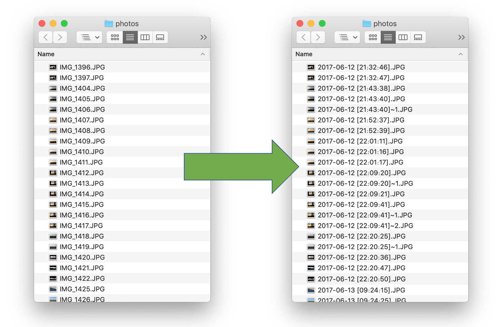
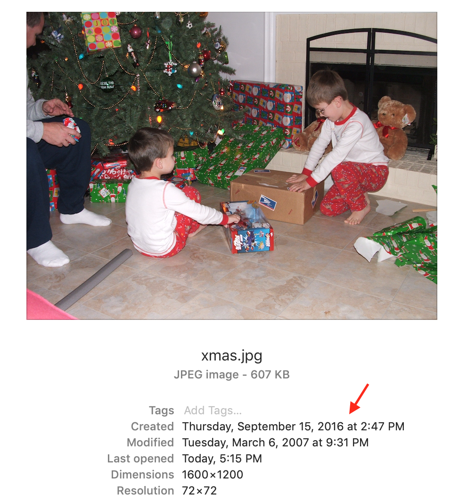
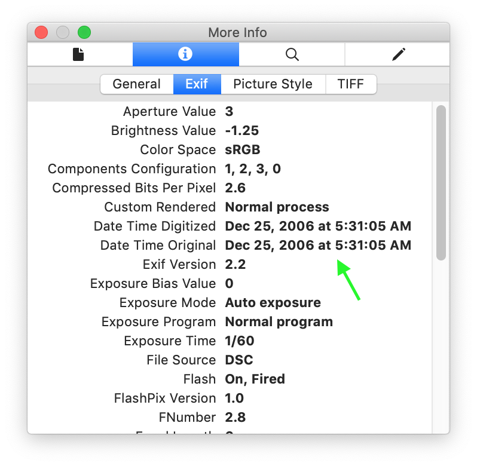
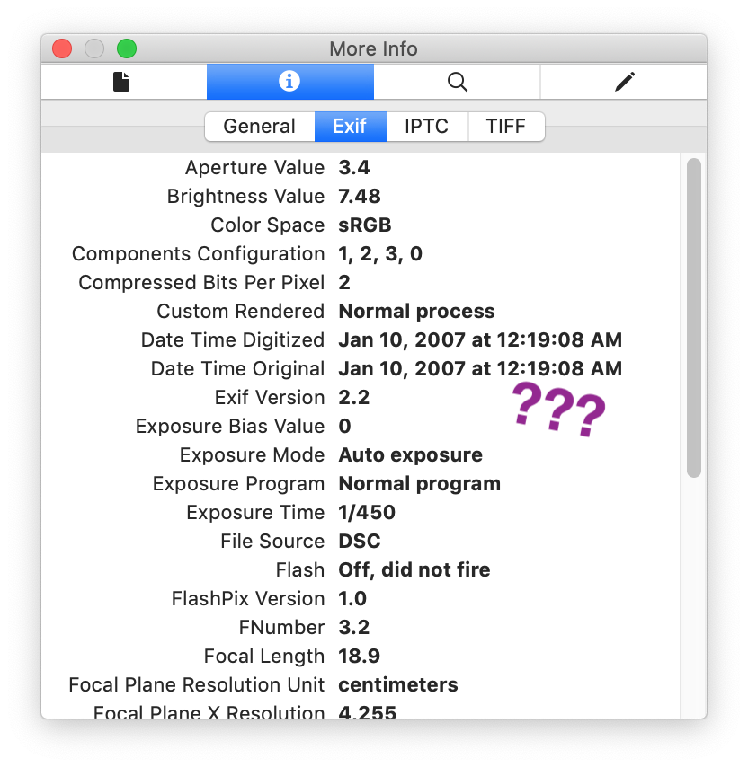
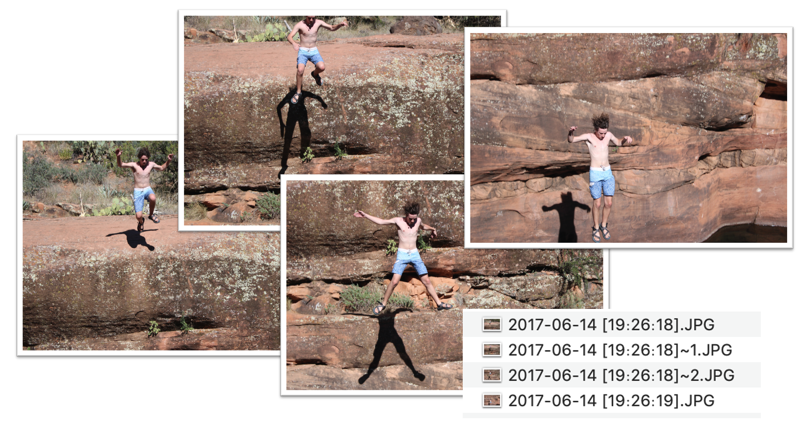

# image-renamer

## What this program does and who it’s for

This tool renames media files to the date and time at which they were created. 

If the image is a JPEG, it gets the timestamp from its Exif data. For other image files and video files, it gets the timestamp from either its created date or its last modified date (whichever is earliest).

This is a handy tool for properly sorting images chronologically, especially if you’re dealing with images from a DSLR that uses unhelpful file naming conventions like “IMG_0037.JPG” (multiple images can have the same name if they’re taken from different SD cards, making it obnoxious to merge all of these images into the same folder).

This tool is also an effective way to chronologically organize photos from different sources. I originally developed this tool to organize family photos from numerous old hard drives spanning over a decade.

## What’s the deal with all these dates?

The created date refers to the date the file was created on the file system on which it is currently located. The modified date refers to the date the file was last written to on the system. These timestamps are sometimes, but not necessarily the time at which the file was initially created. For example, this image of me taken on Christmas morning of 2006 does not show the correct timestamps here:

For this reason, this tool works best with JPEGs, since JPEGs contain the date and time the photo was originally taken embedded in its Exif data. When we take a look at the Exif data for the above image, we can see the correct date and time:

For non-JPEG files, be sure to check that the created and/or modified times seem correct before feeding them into the program.

## Sometimes Exif data is wrong

This is a photo of me swimming in a lake in broad daylight taken sometime in the summer of 2007:

However, the Exif data shows that the photo was taken shortly after midnight on January 10th?

This is because the date and time was not properly set on the camera this picture was taken on, probably because whoever set up the camera simply breezed through the setup process and kept the date set to its default value of January 1st, 2007 at 12:00:00.

Be sure to do a cursory check to see that the Exif data makes sense, particularly if you’re trying to organize older photos where the date and time may not have been properly configured.

## How to check the Exif data

On Mac, open the JPEG image in Preview and press cmd+I. Then, navigate to the “More Info” tab and select “Exif”.

On Windows, right-click the desired JPEG. Then, select “Properties”. Then, select the “Details” tab.

## Got burst photos? Worry not

Images taken in rapid succession may have the same timestamp. This tool accounts for these photos by appending an index at the end so that no photo gets overwritten.

